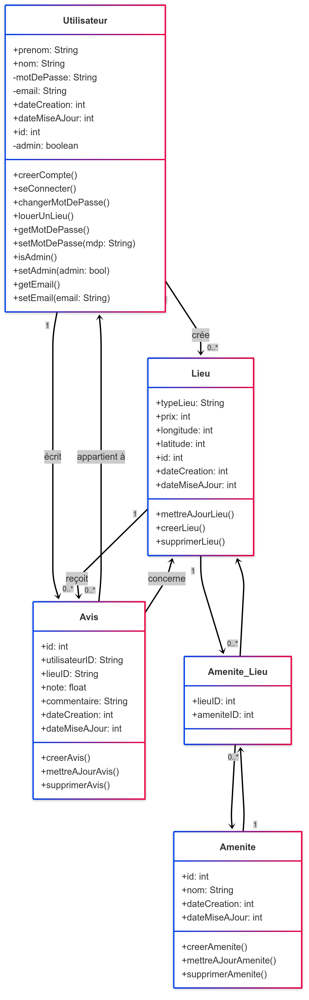

# Document Technique - Projet HBnB

## Introduction
Ce document technique consolide l'ensemble des éléments d'architecture et de conception réalisés pour le projet HBnB. Il vise à servir de référence durant les phases de développement et d’implémentation. Il présente l’architecture globale de l’application, la logique métier, ainsi que les flux d’interaction entre les composants du système via des diagrammes UML et leurs explications.
HBnB est une application web de gestion de lieux (touristiques, culturels, insolites...) permettant à des utilisateurs de consulter, filtrer, proposer et commenter des lieux d'intérêt.

---

## 1. Architecture de Haut Niveau

### 1.1 Diagramme de Packages

  

### 1.2 Description
L'application suit une architecture en couches claire et modulaire :
- **Couche de présentation (Frontend)** : Fournit l’interface utilisateur, gère les interactions et transmet les requêtes au backend.
- **Couche de logique métier (Backend)** : Contient les règles de gestion, la validation des données, la logique d'authentification et de filtrage.
- **Couche de persistance (Base de données)** : Enregistre les entités principales (Utilisateurs, Lieux, Avis, Équipements).

**Patron de Façade**
La logique métier est centralisée via une façade unique qui permet de simplifier les appels entre l’interface et les services internes, améliorant la maintenabilité.

---

## 2. Logique Métier

### 2.1 Diagramme de Classes

  

### 2.2 Description
Le diagramme UML présente les principales entités du système :
- **Utilisateur** : Attributs (email, mot de passe, pseudo), relations avec Avis et Lieux.
- **Lieu** : Décrit un site proposé par un utilisateur, associé à des équipements et des avis.
- **Avis** : Contient une note et un commentaire. Lié à un utilisateur et à un lieu.
- **Équipement** : Lié à un ou plusieurs lieux.

**Choix de conception**
- Utilisation d'une relation de composition entre Lieu et Avis (→ un avis n'existe que dans le contexte d'un lieu).
- Encapsulation de la logique métier dans des classes de service distinctes (ex : `AvisService`, `LieuService`).

---

## 3. Flux d’Interaction - API

### 3.1 Diagrammes de Séquence

### A. Inscription d’un Utilisateur

  

**Étapes clés** :
- Saisie des données utilisateur (frontend)
- Validation côté client
- Transmission à l'API
- Vérification d’unicé, hachage, enregistrement
- Génération d'un token JWT et retour

**Rationale** : Authentification stateless et sécurité accrue via JWT.
---

### B. Création d’un Lieu

  

**Flux** :
- Saisie d’un formulaire avec les caractéristiques du lieu
- Envoi à l’API backend
- Validation, sauvegarde en base, retour d’accusé de réception

---

### C. Filtrage de Lieux

  

**Flux** :
- Critères saisis par l’utilisateur (ville, type, note...)
- Envoi au backend
- Génération de la requête SQL
- Récupération et affichage dynamiques

---

### D. Soumission d’Avis

  

**Flux** :
- Saisie d’une note et d’un commentaire
- Envoi via API avec token d’authentification
- Validation et enregistrement si le token est valide
- Rafraîchissement dynamique de l’interface

---

### 4. Conclusion
Ce document offre une vision consolidée de l’architecture et de la dynamique de l’application HBnB. Il est destiné à être utilisé comme support de référence tout au long du développement, en assurant une compréhension commune de la structure et des flux métier du projet.

---

## 👥 Équipe Projet

| Nom          |
|--------------|
|[Ilmi Veliu](https://github.com/ilmi-veliu)   |
|[Angela Rhin](https://github.com/Sweetyamnesia/sweetyamnesia) |
|[Shakib ROJAS](https://github.com/SR9401)|

---
