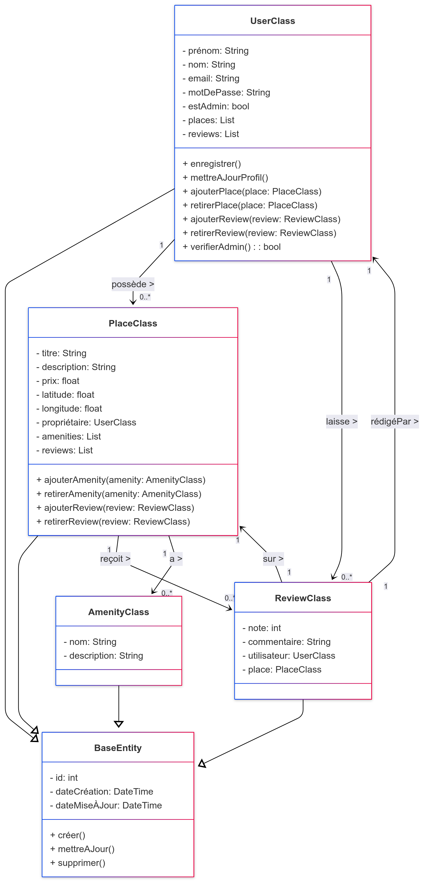
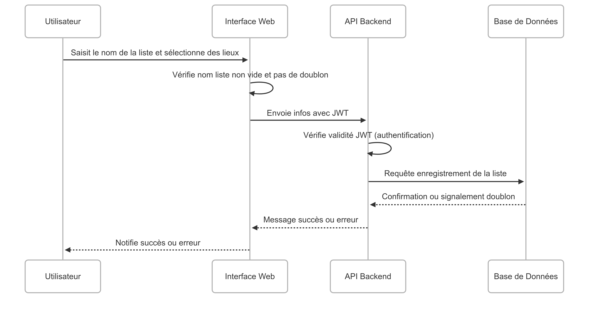
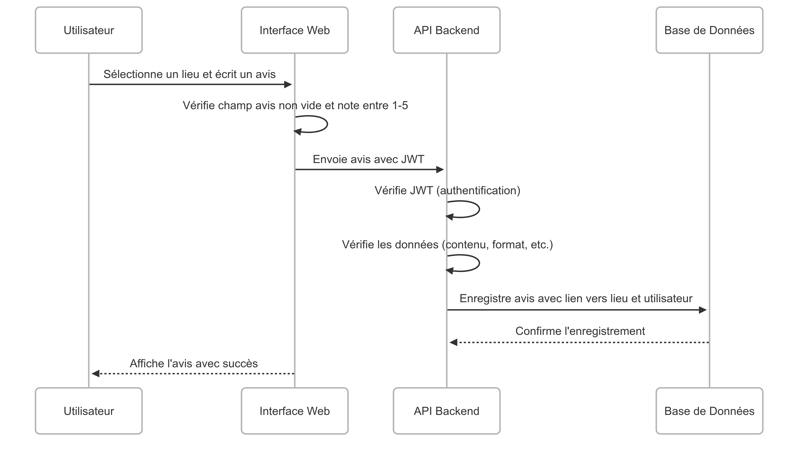
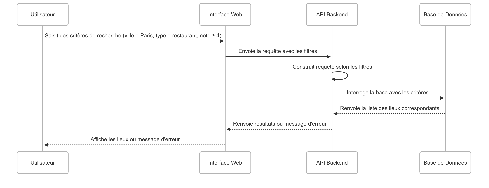

# Projet HbNb

Bienvenue dans notre projet collaboratif de gestion de lieux ! Cette application permet aux utilisateurs de s’inscrire, de consulter une base de lieux, d’en ajouter de nouveaux, de les filtrer selon leurs préférences et de partager des avis. Le tout est pensé pour une expérience fluide et intuitive.

---

## 🧠 Objectif du Projet

Ce projet a pour but de mettre en œuvre une application web simple et fonctionnelle autour de la découverte et du partage de lieux intéressants (sites touristiques, restaurants, spots cachés…).  
Il combine des aspects **frontend**, **backend**, et **base de données**, tout en mettant l’accent sur l’**interaction utilisateur**.

---

## ⚙️ Fonctionnalités Clés

- **Inscription / Connexion** : gestion sécurisée des comptes utilisateurs.
- **Ajout de lieux** : formulaire pour proposer de nouveaux lieux à découvrir.
- **Filtrage dynamique** : interface permettant de trier les lieux selon différents critères (popularité, type, etc).
- **Soumission d’avis** : possibilité de noter et commenter les lieux visités.
- **Visualisation interactive** : consultation facile et rapide des lieux ajoutés.

---

## 📷 Captures & Explications

### 🔹 Diagramme Fonctionnel

  
 Vue d’ensemble des flux applicatifs, de l’enregistrement jusqu’à la gestion des lieux et des avis.

---

### 🔹 Enregistrement Utilisateur

  
 Interface dédiée à la création d’un compte utilisateur sécurisé avec vérification des données côté client et serveur, hachage du mot de passe, et génération d’un jeton JWT pour l’authentification.

---

### 🔹 Création de Listes de Lieux

  
 Fonctionnalité permettant à un utilisateur de créer une nouvelle liste personnalisée de lieux, en saisissant un nom et en sélectionnant des lieux existants. Vérification d’authentification via JWT et gestion des doublons intégrées.

---

### 🔹 Soumission d’Avis

  

Les utilisateurs peuvent évaluer un lieu en attribuant une note et en laissant un commentaire. L’avis est validé côté client et serveur avant d’être enregistré en base et affiché dynamiquement dans l’interface.

---

### 🔹 Filtrage de Lieux

  
 
Module de recherche permettant à l’utilisateur de filtrer la liste des lieux selon différents critères (ville, type, note, etc.). La requête est construite dynamiquement en fonction des filtres sélectionnés, et les résultats sont affichés en temps réel.

---

## 👥 Équipe Projet

| Nom          |
|--------------|
| Ilmi Veliu   |
| Angela Rhin  |
| Rojas Shakib |

---
