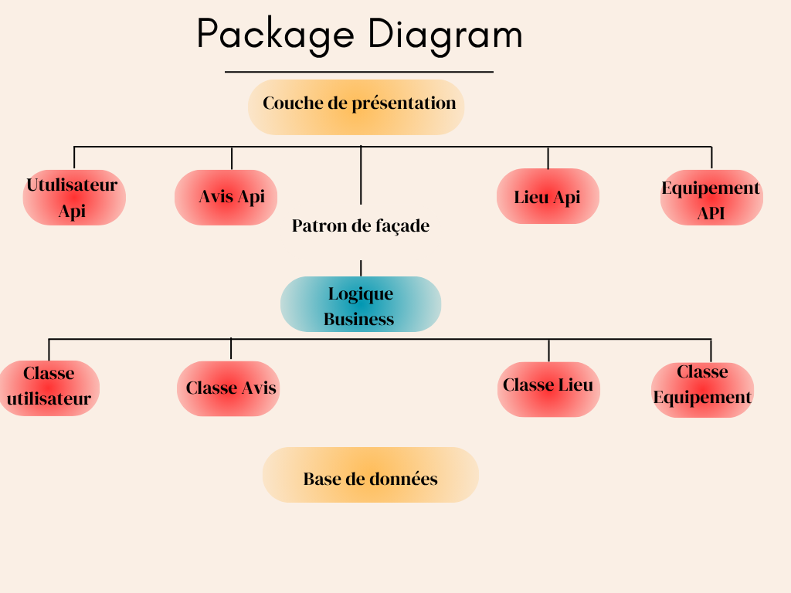
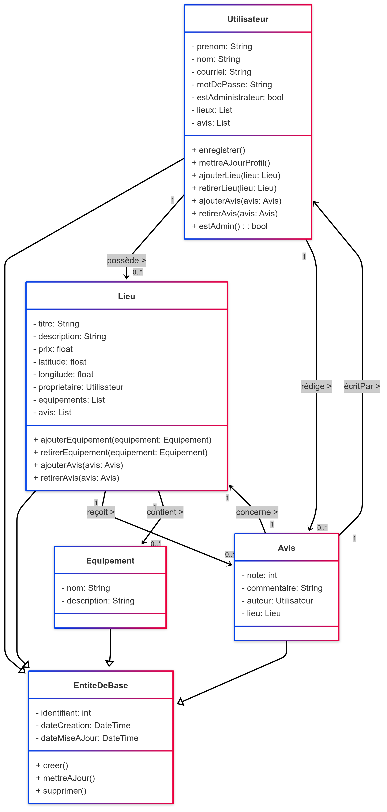
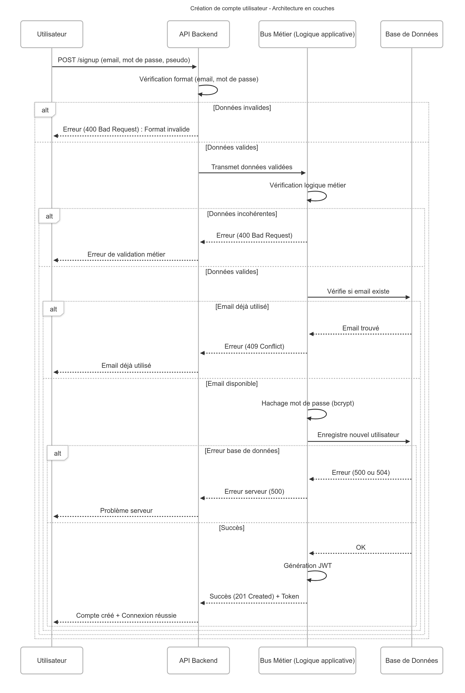
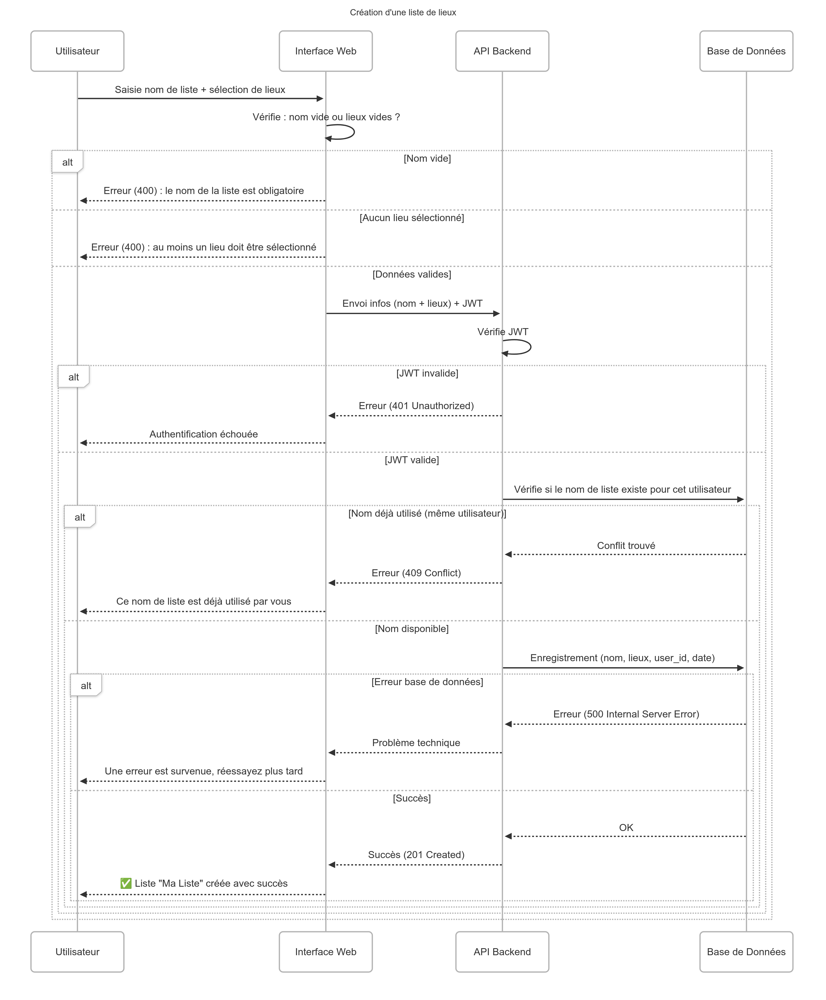
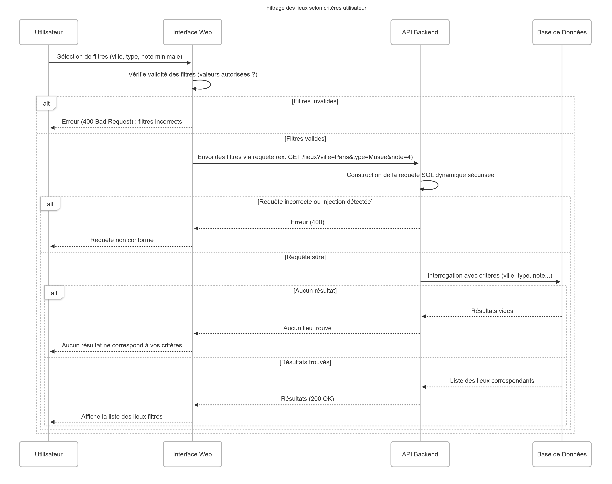

# Projet HbNb

Bienvenue dans notre projet collaboratif de gestion de lieux ! Cette application permet aux utilisateurs de s’inscrire, de consulter une base de lieux, d’en ajouter de nouveaux, de les filtrer selon leurs préférences et de partager des avis. Le tout est pensé pour une expérience fluide et intuitive.

---

## 🧠 Objectif du Projet

Ce projet a pour but de mettre en œuvre une application web simple et fonctionnelle autour de la découverte et du partage de lieux intéressants (sites touristiques, restaurants, spots cachés…).  
Il combine des aspects **frontend**, **backend**, et **base de données**, tout en mettant l’accent sur l’**interaction utilisateur**.

---

## ⚙️ Fonctionnalités Clés

- **Inscription / Connexion** : gestion sécurisée des comptes utilisateurs.
- **Ajout de lieux** : formulaire pour proposer de nouveaux lieux à découvrir.
- **Filtrage dynamique** : interface permettant de trier les lieux selon différents critères (popularité, type, etc).
- **Soumission d’avis** : possibilité de noter et commenter les lieux visités.
- **Visualisation interactive** : consultation facile et rapide des lieux ajoutés.

---

## 📷 Captures & Explications

### 🔹 Diagramme Général

  

Ce diagramme présente la structure logique du projet selon une architecture en couches.
- **Couche de présentation** : Cette couche est responsable de l'interaction avec l'utilisateur. Elle gère l'affichage des données et la communication avec les APIs pour assurer une expérience utilisateur fluide.
- **Logique métier** : Cette couche applique les règles de gestion de l'application. Elle utilise un patron de façade pour centraliser les appels, simplifiant ainsi la communication entre les différentes parties du système.
- **Base de données** : Cette couche est responsable du stockage persistant des données. Elle contient les entités principales du système : `Utilisateur`, `Lieu`, `Équipement`, et `Avis`.

---

### 🔹 Diagramme de Classes

  

Ce diagramme UML détaille les différentes entités manipulées dans l’application ainsi que leurs relations :
- `Utilisateur`, `Lieu`, `Avis`, `Équipement` sont les principales classes métier.
- Chaque entité est représentée avec ses attributs et ses associations.
- Des liens de dépendance entre les couches illustrent l’interaction des composants avec la logique métier et la base.

---

### 🔹 Enregistrement Utilisateur

  

Diagramme de séquence décrivant le processus complet d’inscription :
- Saisie des données (email, mot de passe, pseudo) côté client.
- Vérification de format côté front.
- Transmission des données à l’API backend.
- Vérification de l’unicité, hachage du mot de passe et enregistrement en base.
- Génération d’un JWT pour authentification.
- Réponse au client indiquant le succès ou une erreur.

---
### 🔹 Création Lieux

  

Ce diagramme de séquence montre comment un utilisateur peut créer une liste de lieux :
- **Saisie des critères** : L'utilisateur saisit les critères de recherche pour les lieux (ville, type, note, etc.).
- **Envoi de la requête** : L'interface web envoie ces critères à l'API backend.
**Génération de la requête SQL** : Le backend génère une requête SQL sécurisée pour récupérer les lieux correspondant aux critères.
- **Récupération et affichage des résultats** : Les résultats sont récupérés de la base de données, formatés, puis renvoyés à l'interface web pour être affichés dynamiquement.

---

### 🔹 Soumission d’Avis

  

Les utilisateurs peuvent évaluer un lieu en attribuant une note et en laissant un commentaire :
- **Saisie de l'avis** : L'utilisateur saisit une note et un commentaire pour un lieu.
- **Vérification et envoi** : L'interface web vérifie les données et les envoie à l'API backend.
- **Validation et enregistrement** : Le backend valide l'authenticité de l'auteur via un token, vérifie les contraintes métiers (note entre 1 et 5, champ texte non vide), et enregistre l'avis en base de données.
- **Mise à jour dynamique** : L'interface met à jour dynamiquement les avis affichés pour chaque lieu.

---

### 🔹 Filtrage de Lieux

  

L’utilisateur saisit des critères (ville, type, note) :
- **Saisie des critères** : L'utilisateur saisit les critères de filtrage via l'interface web.
- **Envoi de la requête** : L'interface web envoie la requête contenant les filtres sélectionnés à l'API backend.
- **Génération de la requête SQL** : Le backend génère dynamiquement une requête SQL sécurisée pour récupérer les lieux correspondant aux critères.
- **Affichage des résultats** : Les résultats sont récupérés de la base de données, formatés, puis renvoyés à l'interface web pour être affichés dynamiquement, améliorant ainsi l'expérience utilisateur grâce à une recherche rapide et contextuelle.

---

## 👥 Équipe Projet

| Nom          |
|--------------|
|[Ilmi Veliu](https://github.com/ilmi-veliu)   |
|[Angela Rhin](https://github.com/Sweetyamnesia/sweetyamnesia) |
|[Shakib ROJAS](https://github.com/SR9401)|

---
